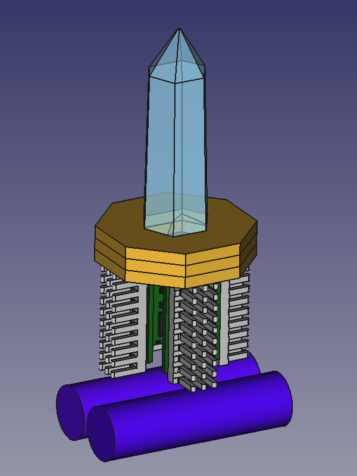
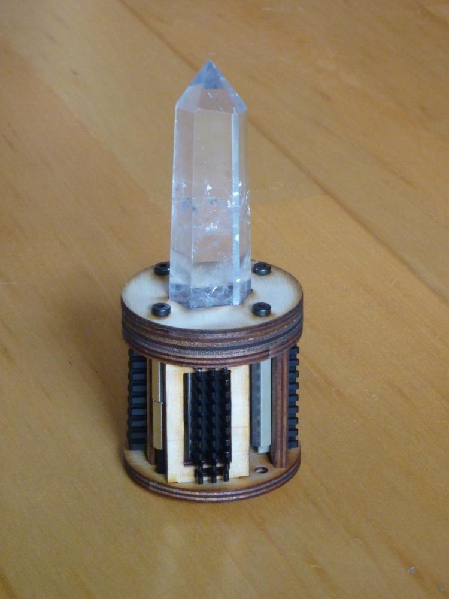

<!--lint disable list-item-indent-->
<!--lint disable list-item-bullet-indent-->

# magic_crystal
CAD design for magic sparkle crystal

More documentation to be done.. ;-)

more images in the [Gallery](gallery.md)

## Software
have a look at [magic_crystal_animation](https://github.com/s-light/magic_crystal_animation)

## HW
- 4x [LEDBoard_4x4_HD](https://github.com/s-light/LEDBoard_4x4_HD)
- 4x 1/3-part of Heatsink [ICK PGA 14 x 14 x 12](https://www.fischerelektronik.de/web_fischer/de_DE/K%C3%BChlk%C3%B6rper/B01/K%C3%BChlk%C3%B6rper%20f%C3%BCr%20PGA/PR/ICKPGA14x14x12_/parameters/index.xhtml/) ([3d-model](https://github.com/s-light/LEDBoard_4x4_16bit/tree/master/parts/mechanical))
- 8x [nut M3](https://www.wegertseder.com/ArticleDetails.aspx?ANR=4445-100)
- 8x [screw M3x20](https://www.wegertseder.com/ArticleDetails.aspx?AKNUM=2588&Diameter=3)
- lasercut wood
    - 4mm plywood
        - 1x crystal_mounting_layer1
        - 1x crystal_mounting_layer2
        - 1x crystal_mounting_layer3
        - 1x lightguides_mounting
        - 1x bottom
    - 1mm plywood
        - 4x lightblocker_side
        - 1x crystal_mounting_layer4
- electronics
    - 1x [Adafruit ItsyBitsy M4](https://learn.adafruit.com/introducing-adafruit-itsybitsy-m4)  
    or other CircuitPython compatible board   
    (Arduino firmware not done yet..)
    - 1x Ambient-Light-Sensor
    - 2x Momentary-Push-Button
    - DC-DC converter [Pololu 5V, 5A Step-Down Voltage Regulator D24V50F5](https://www.pololu.com/product/2851)
    - batteries
        - for first tests i will use 4x a older version of [Lithium Ion Cylindrical Battery - 3.7v 2200mAh](https://www.exp-tech.de/en/accessories/batteries/lipo/7391/lithium-ion-cylindrical-battery-3.7v-2200mah?c=1191)
        the older version has a maximal discharge current of ~500mA -  
        so i can not use the full power of the LEDBoards..
        4x6W=24W → 27W (input with loss of DC/DC converter)
        4x3.7V = 14,8V → 1,8 A
        (4x3.7V) * 0,5A = 5,92 W
        - later eventually switching to LiFePo4 (similar to [4s1p A123 ANR26650M1B 2x2-Pack 13,2V 2,5Ah](https://www.asn-shop.de/4s1p-A123-ANR26650M1B-2x2-Pack-132V-25Ah))
