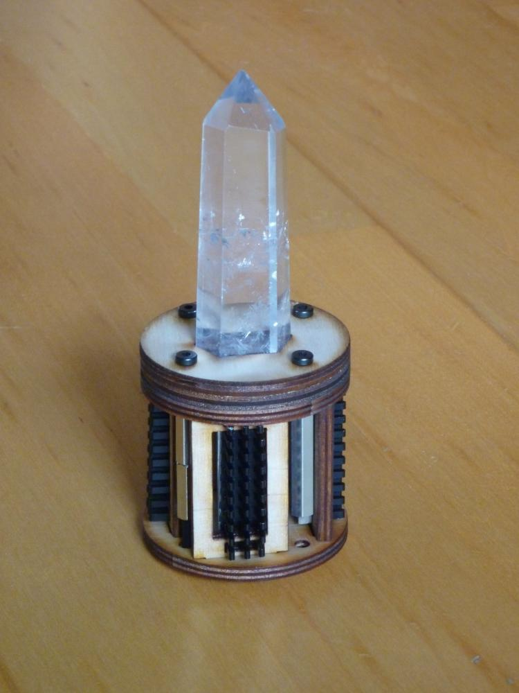
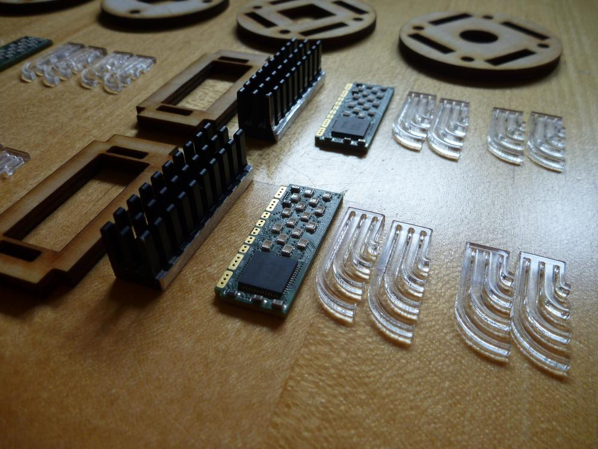
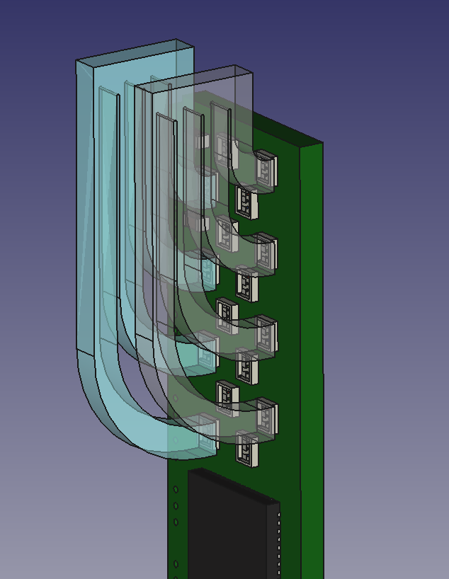
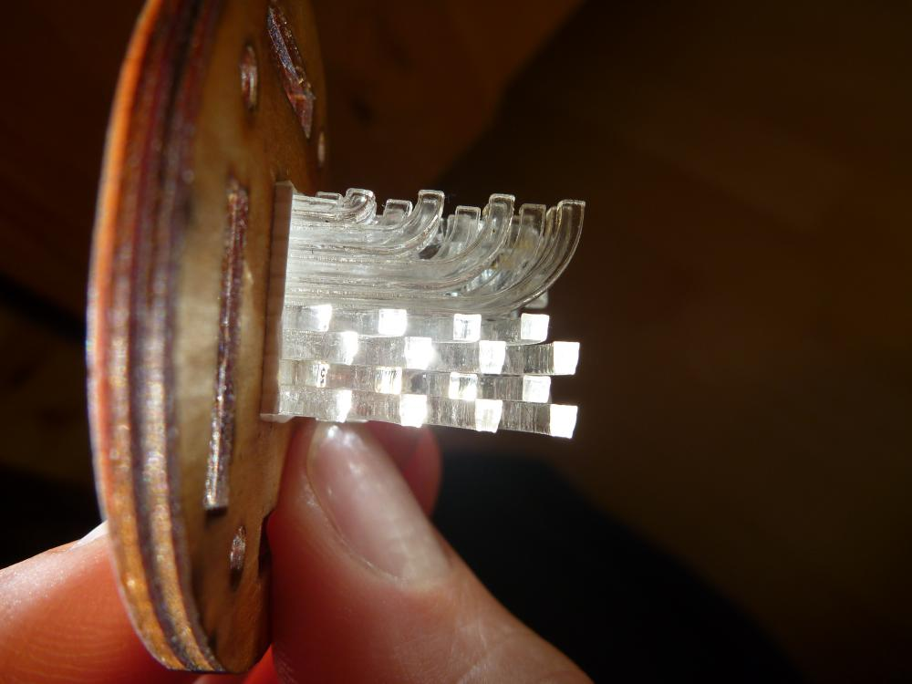

<!--lint disable list-item-indent-->
<!--lint disable list-item-bullet-indent-->

# Gallery
Some impressions of the parts and the build process...

<!-- TOC depthFrom:2 depthTo:6 withLinks:1 updateOnSave:1 orderedList:0 -->

- [CAD](#cad)
- [REAL](#real)
	- [current design](#current-design)
	- [first design](#first-design)
- [lightguides](#lightguides)
- [assembly](#assembly)

<!-- /TOC -->

## CAD

## REAL

### current design

### first design

## lightguides

## assembly

